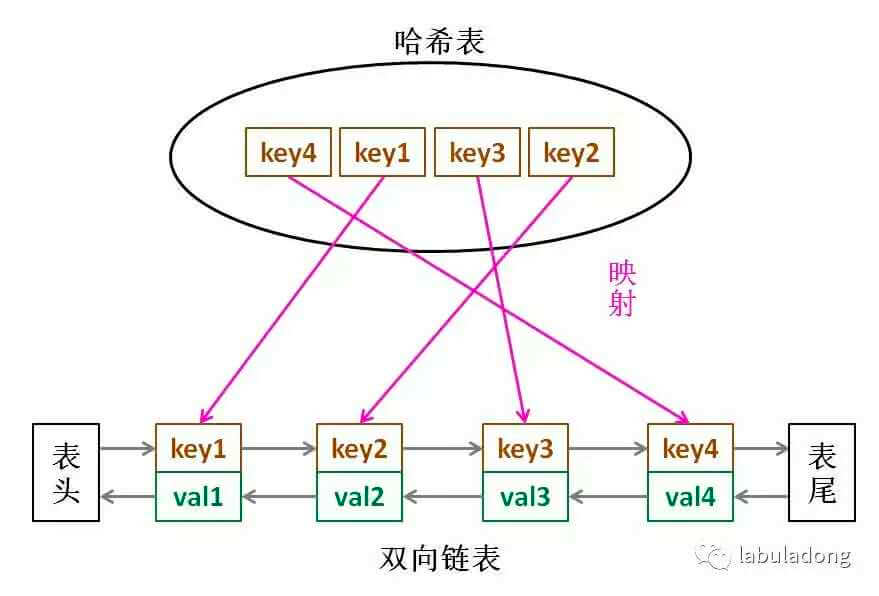

## LRU

[146. LRU 缓存](https://leetcode.cn/problems/lru-cache/)

- 使用 linkedHashmap 实现
- 如果不使用 linkedhashmap， 需要实现双向链表+map


1. 为什么要使用双向链表实现?<br>
   *删除的时候需要移动前后节点的指针，只有双向链表才能保证操作的时间复杂度为O(1)*
2. 为什么要在链表中同时存储 key 和 val，而不是只存储 val?<br>
   *因为当缓存容量满的时候，不仅仅要删除最后一个 node 节点，而且要把map中的key同时删除。但如果node 中只存val 就无法定位map中但键*


```java
public class LRUCache {
    int cap; // 表示这个cache 支持多大
    LinkedHashMap<Integer, Integer> cache = new LinkedHashMap<>();

    public LRUCache(int capacity){
        this.cap = capacity;
    }

    // get 方法
    public int get(int key){
        if(!cache.containsKey(key)){
            return -1;
        }
        // 同时将 key 变为最近使用
        makeRecently(key);
        return cache.get(key);
    }

    public void put(int key, int val){
        if(cache.containsKey(key)){
            // 修改 key 的值
            cache.put(key, val);
            // 同时将 key 变为最近使用
            makeRecently(key);
            return;
        }
        // 容量超过，顶替掉head，第二个元素变成head
        if (cache.size() >= this.cap){
            // 获取cache中的key，为一个iterator，获取iterator的第一个值
            int oldestKey = cache.keySet().iterator().next();
            cache.remove(oldestKey);
        }
        // 将新的 key 添加到链表尾部
        cache.put(key, val);
    }

    private void makeRecently(int key) {
        int val = cache.get(key);
        // 删除 key， 重写插入到队尾
        cache.remove(key);
        cache.put(key, val);
    }

    public static void displayCache(LinkedHashMap<Integer,Integer> cache){
        // * 打印cache方便观察
        cache.entrySet().forEach(entry -> {
            System.out.println(entry.getKey()+" "+ entry.getValue());
        });
    }
}
```