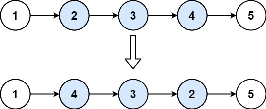
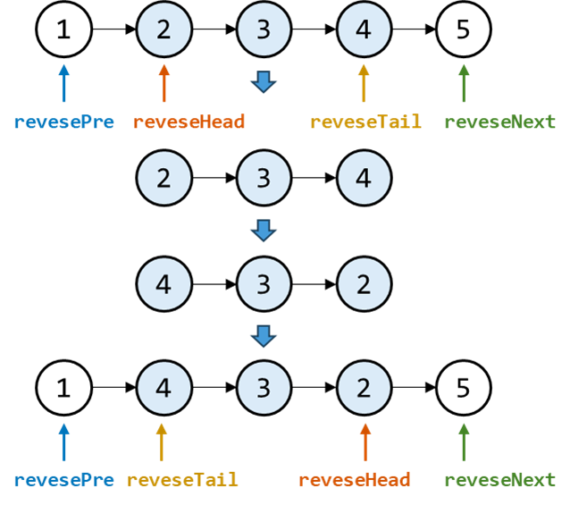

### [反转链表]([https://leetcode.cn/problems/fan-zhuan-lian-biao-lcof/](https://leetcode.cn/problems/reverse-linked-list/solutions/2361282/206-fan-zhuan-lian-biao-shuang-zhi-zhen-r1jel/))
- 递归
  - 需要将每次结果给 newHead
- 迭代
  - 首尾两个指针
  - 尾指针prev为null初始，翻转后是首节点
  1. 先将cur.next 保存为临时变量
  2. 将cur节点指向 prev节点
  3. 将cur节点赋给prev节点
  4. 移动cur到下一个节点
```java
public class ListNode {
    public ListNode reverseList0(ListNode head){
        // 【1】. 递归
        if(head == null || head.next == null) {
            return head;
        }
        ListNode newHead = reverseList(head.next);
        head.next.next = head;
        head.next = null;
        return newHead;
    }

    public ListNode reverseList1(ListNode head){
        // 【2】. 迭代，首尾双指针
        // prev是新指针的头，也是每次迭代的前置节点
        ListNode cur = head, prev = null;

        while (cur != null) { // 遍历整个链表
            ListNode temp = cur.next; // 暂存后继节点（每次计算从cur和temp处断开）
            cur.next = prev; // 修改cur指向（cur指向temp）
            prev = cur; // cur节点反转完毕，更新prev节点
            cur = temp; // 移动到下一个节点
        }
        return prev;
    }
}
```

### [反转链表 II](https://leetcode.cn/problems/reverse-linked-list-ii/)
**题目**： 就是给定左右位置，翻转`[left,right]`之间的节点<br>


**题解**：


- cur遍历后为 reverseNext 节点
```java
public class ListNode {
    public ListNode reverseBetween(ListNode head, int left, int right) {
        ListNode dummy = new ListNode(0, head);
        ListNode reversePre = dummy;
        for (int i = 1; i < left; i++) {
            reversePre = reversePre.next;
        }

        //  从此节点开始反转 区间[left, right]的节点
        ListNode reverseHead = reversePre.next; // reverseHead为反转区间后tail节点
        ListNode prev = null; //拟定反转后的头节点
        ListNode cur = reverseHead; // cur 节点就是反转后的reverseNext节点
        for (int i = left; i <= right; i++) {
            ListNode temp = cur.next;
            cur.next = prev;
            prev = cur;
            cur = temp;
        }
        // 拼接
        reversePre.next = prev;
        reverseHead.next = cur;

        return dummy.next;
    }
}
```

