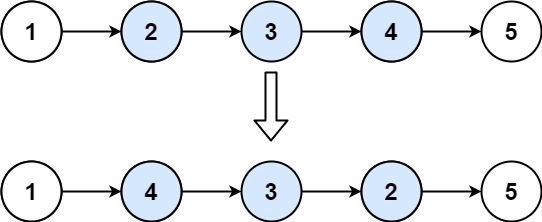
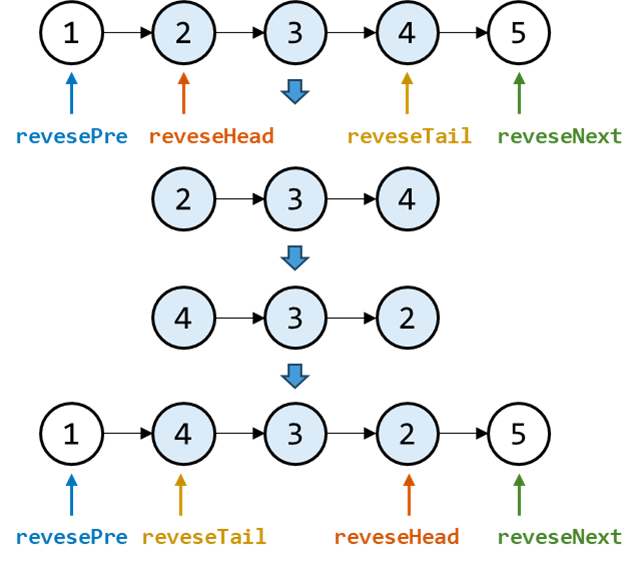

### [反转链表]([https://leetcode.cn/problems/fan-zhuan-lian-biao-lcof/](https://leetcode.cn/problems/reverse-linked-list/solutions/2361282/206-fan-zhuan-lian-biao-shuang-zhi-zhen-r1jel/))
- 递归
  - 需要将每次结果给 newHead
- 迭代
  - 首尾两个指针
  - 尾指针prev为null初始，翻转后是首节点
  1. 先将cur.next 保存为临时变量nxt
  2. 将cur节点指向 prev节点
  3. 将cur节点赋给prev节点
  4. 移动cur到下一个节点
```java
public class ListNode {
    public ListNode reverseList0(ListNode head){
        // 【1】. 递归
        if(head == null || head.next == null) {
            return head;
        }
        ListNode newHead = reverseList0(head.next);
        head.next.next = head;
        head.next = null;
        return newHead;
    }

    public ListNode reverseList1(ListNode head){
        // *【2】. 迭代，首尾双指针
        // 优先写模板化的迭代法，避免递归法的栈溢出风险
        if(head == null || head.next == null) {
            return head;
        }
        // prev是新指针的头，也是每次迭代的前置节点
        ListNode cur = head, prev = null;

        while (cur != null) { // 遍历整个链表
            ListNode nxt = cur.next; // 暂存后继节点（每次计算从cur和next处断开）
            cur.next = prev; // 修改cur指向（cur指向temp）
            prev = cur; // cur节点反转完毕，更新prev节点
            cur = nxt; // 移动到下一个节点
        }
        return prev;
    }
}
```

#### [反转链表 II](https://leetcode.cn/problems/reverse-linked-list-ii/)
**题目**： 就是给定左右位置，翻转`[left,right]`之间的节点<br>


**题解**：

1.核心思路是翻转完left到right个节点，然后把left-1和right相连，把left相连right+1

2.但当left为1时，会出现没有left-1节点情况，所以通过添加dummy节点来兼容两种情况


- cur遍历后为 reverseNext 节点
```java
public ListNode reverseBetween(ListNode head, int left, int right) {
    ListNode dummy = new ListNode(0, head);
    ListNode reversePre = dummy; // 反转前的前驱节点
    for (int i = 1; i < left; i++) {
        reversePre = reversePre.next;
    }

    //  从此节点开始反转 区间[left, right]的节点
    ListNode cur = reversePre.next; // 区间的起点，第一个要反转的节点
    ListNode prev = null; //拟定反转后的头节点

    for (int i = left; i <= right; i++) {
        ListNode nxt = cur.next;
        cur.next = prev;
        prev = cur;
        cur = nxt;
    }
    // 循环结束，cur指向区间之后的节点
  
    // 拼接
    ListNode reverseTail = reversePre.next; // 是翻转前的head，翻转后是翻转段尾节点
    reverseTail.next = cur; // 尾部连接
    reversePre.next = prev; // 头部连接

    return dummy.next;
}
```
### 删除链表的倒数第 k 个节点
- 思路：dummy节点+快慢指针
```java
public ListNode removeNthFromEnd(ListNode head, int k) {
    ListNode dummy = new ListNode(0); // 哑节点，简化头节点删除
    dummy.next = head;
    ListNode slow = dummy;
    ListNode fast = dummy;
    // 快指针先走k步
    for (int i = 0; i < k; i++) {
        fast = fast.next;
    }
    // 快慢指针同速移动
    while (fast.next != null) {
        slow = slow.next;
        fast = fast.next;
    }
    slow.next = slow.next.next; // 删除目标节点
    return dummy.next;
}
```

#### [交换链表中的节点](https://leetcode.cn/problems/swapping-nodes-in-a-linked-list/)
**题目**： 给你链表的头节点 head 和一个整数 k 。
交换链表正数第 k 个节点和倒数第 k 个节点的值后，返回链表的头节点（链表 从 1 开始索引）。<br>

**题解**：

1.通过快慢指针定位到倒数第k个节点

2.当前版本为值交换版，todo指针交换版本

```java
class Solution {
    public ListNode swapNodes(ListNode head, int k) {
      ListNode first = head;
      // 找第 k 个节点
      for (int i = 1; i < k; i++) {
        first = first.next;
      }
      // 双指针找倒数第 k 个节点
      ListNode fast = head, slow = head;
      for (int i = 1; i < k; i++) {
        fast = fast.next;
      }
      while (fast.next != null) {
        fast = fast.next;
        slow = slow.next;
      }
      // first 是第 k 个节点，slow 是倒数第 k 个节点
      int temp = first.val;
      first.val = slow.val;
      slow.val = temp;
      return head;
    }
}
```

### 环形链表 II（找环的入口，快慢指针进阶）
- 先让快慢指针相遇
- 相遇后让 slow 指针回到原点
- 让快慢指针同步前进，相遇即环的入口节点
```java
public ListNode detectCycle(ListNode head) {
    if (head == null || head.next == null) return null;
    ListNode slow = head;
    ListNode fast = head;
    // 第一步：判断是否有环，快慢指针相遇
    while (fast != null && fast.next != null) {
      slow = slow.next;
      fast = fast.next.next;
      if (slow == fast) break;
    }
    // 无环，返回null（必写边界）
    if (fast == null || fast.next == null) return null;
    // 第二步：慢指针移回头节点，同速移动找入口
    slow = head;
    while (slow != fast) {
      slow = slow.next;
      fast = fast.next;
    }
    return slow;
}
```