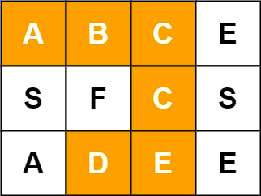
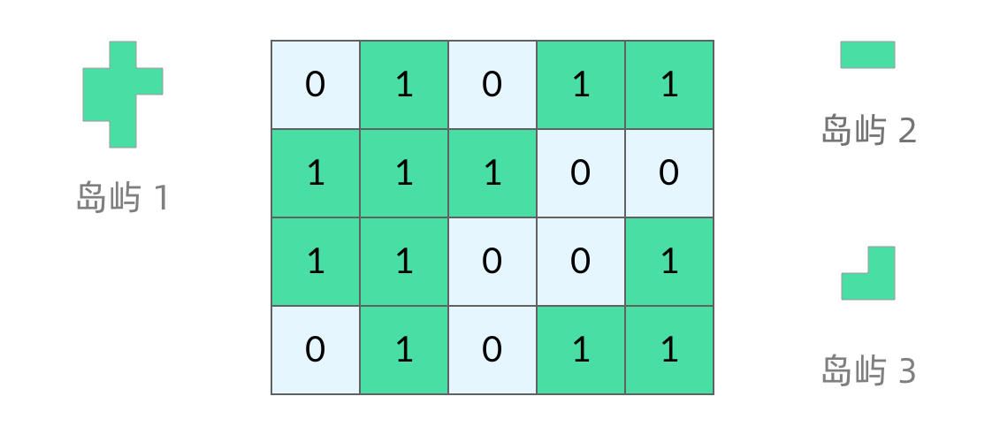

# 深度优先
我们所熟悉的 DFS（深度优先搜索）问题通常是在树或者图结构上进行的

## 1. 回溯问题
本质是一个brute force算法，是一个决策树的遍历过程

```python
result = []
def backtrack(start, 路径, 选择列表):
    if 满足结束条件:   ## step1.
        result.add(路径)
        return
    
    for i in 选择列表:  ## step2.
        做选择
        backtrack(i + 1, 路径, 选择列表)  ## step3.
        撤销选择
```
**列题0**：[全排列](https://leetcode.cn/problems/permutations/)<br>
**输入**：nums = [1,2,3]<br>
**输出**: [[1,2,3],[1,3,2],[2,1,3],[2,3,1],[3,1,2],[3,2,1]]

```java
public class 回溯 {
    List<List<Integer>> res = new ArrayList<>();

    /* 主函数，输入一组不重复的数字，返回它们的全排列 */
    List<List<Integer>> permute(int[] nums) {
        // 记录「路径」
        ArrayList<Integer> track = new ArrayList<>();
        // 「路径」中的元素会被标记为 true，避免重复使用
        boolean[] used = new boolean[nums.length];
        // 直接调用 dfs
        backtrack(nums, track, used);

        return res;
    }

    // 路径：记录在 track 中
    // 选择列表：nums 中不存在于 track 的那些元素（used[i] 为 false）
    // 结束条件：nums 中的元素全都在 track 中出现
    void backtrack(int[] nums, ArrayList<Integer> track, boolean[] used) {
        // 触发结束条件
        if (track.size() == nums.length) {
            res.add(new ArrayList(track));
            return; // 不写此 return会栈溢出
        }

        for (int i = 0; i < nums.length; i++) {
            // 排除不合法的选择
            if (used[i]) {
                // nums[i] 已经在 track 中，跳过
                continue;
            }
            // 做选择
            track.add(nums[i]);
            used[i] = true;
            // 进入下一层决策树
            backtrack(nums, track, used);
            // 取消选择
            track.remove(track.size()-1);
            used[i] = false;
        }
    }
}
```

**例题1：[求子集](https://labuladong.gitee.io/algo/1/7/)**<br>
输入：nums = [1,2,3]<br>
输出 [ [],[1],[2],[3],[1,2],[1,3],[2,3],[1,2,3] ]

```java
public class 求子集 {
    List<List<Integer>> res = new ArrayList<>();
    // 记录回溯算法的递归路径

    public List<List<Integer>> subsets(int[] nums) {
        List<Integer> track = new ArrayList<>();
        backtrack(nums, track, 0);
        return res;
    }

    // 回溯算法核心函数，遍历子集问题的回溯树
    // start为第几层，每次回遡到上一层
    void backtrack(int[] nums, List<Integer> track, int start) {
        // 前序位置，每个节点的值都是一个子集
        res.add(new ArrayList<>(track));
        // 回溯算法标准框架
        for (int i = start; i < nums.length; i++) {
            // 做选择
            track.add(nums[i]);
            // 通过 i + 1 控制树枝的遍历，避免产生重复的子集
            // 如果传入start + 1 就是在原有路径上重复遍历
            backtrack(nums, track, i + 1);
            // 撤销选择
            track.remove(track.size() - 1);
        }
    }
}
```
**例题2**：[17. 电话号码的字母组合](https://leetcode.cn/problems/letter-combinations-of-a-phone-number/)<br>
示例 1：
输入：digits = "23" <br>
输出：["ad","ae","af","bd","be","bf","cd","ce","cf"]

```java
public class Solution {
    private Map<Character, String> phoneMap = new HashMap<Character, String>() {{
        put('2', "abc");
        put('3', "def");
        put('4', "ghi");
        put('5', "jkl");
        put('6', "mno");
        put('7', "pqrs");
        put('8', "tuv");
        put('9', "wxyz");
    }};

    // 路径
    private StringBuilder path = new StringBuilder();

    // 结果集
    private List<String> res = new ArrayList<>();

    public List<String> letterCombinations(String digits) {
        if (digits.isEmpty()) {
            return res;
        }
        dfs(digits, 0);
        return res;
    }

    /**
     * "2","3"输出结果是 "ad","ae","af" --- "bd","be","bf" --- "cd","ce","cf"
     *
     * @param digits 键盘输入的数字
     * @param index 用index来遍历每个数字对应的字符串：abc、 def、 ghi
     */
    public void dfs(String digits, int index) {
        // 长度符合要求，加入结果集
        if (path.length() == digits.length()) {
            res.add(path.toString());
            return;
        }
        // 当前字母对应的字符串，需要逐个遍历加入path中 : abc
        String strs = phoneMap.get(digits.charAt(index));
        for (char ch : strs.toCharArray()) {
            path.append(ch);
            dfs(digits, index + 1); // 切换到下一个字母
            path.deleteCharAt(path.length() - 1);
        }
    }
}
```

**例题3**：[79. 单词搜索](https://leetcode.cn/problems/word-search/description/)<br>
**题目**：给定一个m * n二维字符网格board和一个字符串单词word，求word是否在网格中（同一个位置的字母，不可用被重复用）<br>
**示例**：



**思路**：
1. 回溯
2. 需要对每个格子作为起点进行计算
3. 递归结束条件是，word全遍历完
```java
public class Solution {
    public boolean exist(char[][] board, String word) {
        char[] words = word.toCharArray();
        // 不允许往回算，所以需要一个visited 数组
        boolean[][] visited = new boolean[board.length][board[0].length];
        for (int i = 0; i < board.length; i++) {
            for (int j = 0; j < board[0].length; j++) {
                if (dfs(board, visited, words, i, j, 0)) return true;
            }
        }
        return false;
    }

    public boolean dfs(char[][] board, boolean[][] visited, char[] word, int x, int y, int index) {
        /*
         * index: 为在word上的游标
         */
        if (x >= board.length || x < 0 || y >= board[0].length || y < 0) {
            return false;
        }

        if (visited[x][y]) {
            return false;
        }

        if (board[x][y] != word[index]) {
            return false;
        }

        if (index == word.length - 1) {
            return true;
        }

        int[][] directions = {{0,1}, {1,0},{-1,0},{0,-1}};
        visited[x][y] = true;
        for (int[] each : directions) {
            if (dfs(board, visited, word, each[0] + x, each[1] + y, index + 1)) {
                // 如果递归中有正确解，即可直接返回
                return true;
            }
        }
        visited[x][y] = false;
        return false;
    }
}
```

## 2. 岛屿相关（blood fill）
比如：
* [岛屿数量](https://leetcode.cn/problems/number-of-islands/) （Easy）
* [岛屿的周长](https://leetcode.cn/problems/island-perimeter/) （Easy）
* [岛屿的最大面积](https://leetcode.cn/problems/max-area-of-island/) （Medium）
* 最大人工岛 （Hard）

如图：每个格子中的数字可能是 0 或者 1。我们把数字为 0 的格子看成海洋格子，数字为 1 的格子看成陆地格子，这样相邻的陆地格子就连接成一个岛屿。




```java
class IslandTemplate {
    void dfs(int[][] grid, int row, int col) {
        // 判断 base case
        // 如果坐标 (r, c) 超出了网格范围，直接返回
        if (!inArea(grid, row, col)) {
            return;
        }

        // 如果格子不是岛屿，直接返回
        if (grid[row][col] != 1) {
            return;
        }

        // 标记岛屿，表明已遍历过
        grid[row][col] = 2;

        // 访问上、下、左、右四个相邻结点
        dfs(grid, row - 1, col);
        dfs(grid, row + 1, col);
        dfs(grid, row, col - 1);
        dfs(grid, row, col + 1);
    }

    // 判断坐标 (r, c) 是否在网格中
    boolean inArea(int[][] grid, int r, int c) {
        return 0 <= r && r < grid.length // r在 [0. length) 范围内
                && 0 <= c && c < grid[0].length; // c在 [0. length) 范围内
    }
}
```
[ref1.](https://leetcode.cn/problems/number-of-islands/solution/dao-yu-lei-wen-ti-de-tong-yong-jie-fa-dfs-bian-li-/)
[ref2.](https://labuladong.gitee.io/algo/4/31/107/)
## 3. 树

前序遍历：
```java
class TreeTravel {
    void traverse(TreeNode root) {
        // 判断 base case
        if (root == null) {
            return;
        }
        // 访问两个相邻结点：左子结点、右子结点
        traverse(root.left);
        traverse(root.right);
    }
}
```


**例题3** [236. 二叉树的最近公共祖先](https://leetcode.cn/problems/lowest-common-ancestor-of-a-binary-tree/solution/236-er-cha-shu-de-zui-jin-gong-gong-zu-xian-hou-xu/)

**思路**：
1.
```java
public class Solution {

    public TreeNode lowestCommonAncestor(TreeNode root, TreeNode p, TreeNode q) {
        if (root == null) {
            return null;
        }
        // 只要当前根节点是p和q中的任意一个，就返回（因为不能比这个更深了，再深p和q中的一个就没了）
        if (root == p || root == q) {
            return root;
        }
        // 两个节点都在左子树上
        if (containNode(root.left, p) && containNode(root.left, q)) {
            return lowestCommonAncestor(root.left, p, q);
        }
        // 两个节点都在右子树上
        if (containNode(root.right, p) && containNode(root.right, q)) {
            return lowestCommonAncestor(root.right, p, q);
        }
        // 如果p,q分属两侧，则公共祖先为根节点
        return root;
    }

    public boolean containNode(TreeNode root, TreeNode node) {
        if (root == null) {
            return false;
        }
        if (root.val == node.val) {
            return true;
        }

        return containNode(root.left, node) || containNode(root.right, node);
    }
}    
```

**例题4**：[剑指 Offer 26. 树的子结构](https://leetcode.cn/problems/shu-de-zi-jie-gou-lcof/)<br>
**题目**：输入两棵二叉树A和B，判断树B是不是A的子结构，返回一个boolean结果<br>
**思路**：
1. 先序遍历树A中的每个节点An是否包含B树（isSubStructure），对每个A节点都去和B树做比较
2. 判断以An节点开始是否和B树重合（recur）：分别匹配两个树的左右节点
```java
class Solution {
    public boolean isSubStructure(TreeNode A, TreeNode B) {
        if (A == null || B == null) {
            return false;
        }
        if (recur(A, B)) {
            return true;
        }
        return isSubStructure(A.left, B) || isSubStructure(A.right, B);
    }

    public boolean recur(TreeNode A, TreeNode B) {
        if (B == null) {
            return true;
        }
        if (A == null) {
            return false;
        }
        if (A.val != B.val) {
            return false;
        }

        return recur(A.left, B.left) && recur(A.right, B.right);
    }
}
```


**例题5**：[剑指 Offer 07. 重建二叉树](https://leetcode.cn/problems/zhong-jian-er-cha-shu-lcof/)<br>
**题目**：输入某二叉树的前序遍历和中序遍历的结果`数组`，请构建该二叉树并返回其根节点。<br>
**前提条件**：树中没有重复的数字！<br>
**思路**：
- 分治的思想
- 比如`preorder = [3,9,20,15,7]`，`inorder = [9,3,15,20,7]`
- 可以推断得出 `3` 是这个树的根节点，在inorder中，`3` 左边是左子树，右边为右子树
- 这样递归可以求得整个树
- 左右子树构建：

|     | preorder根节点      | inorder左边界      | inorder右边界      |
|-----|------------------|-----------------|-----------------|
| 左子树 | root + 1         | left            | in_root_idx - 1 |
| 右子树 | root + 1 + 左子树长度 | in_root_idx + 1 | right           |


```java
public class Solution {
    Map<Integer, Integer> map = new HashMap<>();  // 标记 inorder

    int[] preOrder;

    public TreeNode buildTree(int[] preorder, int[] inorder) {
        this.preOrder = preorder;

        for (int i = 0; i < inorder.length; i++) {
            map.put(inorder[i], i);
        }

        return recur(0, 0, inorder.length - 1);
    }

    public TreeNode recur(int pre_root_idx, int in_left_idx, int in_right_idx) {
        /*
         * 
         */
        if (in_left_idx > in_right_idx) // 相等的话就是自己
            return null;

        TreeNode root = new TreeNode(this.preOrder[pre_root_idx]); // 初始化root

        int in_root_idx = map.get(this.preOrder[pre_root_idx]); // 根节点在inorder中的index

        // 左子树根节点：根节点向右 + 1
        root.left = recur(pre_root_idx + 1, in_left_idx, in_root_idx - 1);
        // 右子树根节点：根节点向右 + 1 + 左子树长度（中序中，左边界到根节点的距离）
        root.right = recur(pre_root_idx + 1 + (in_root_idx - in_left_idx), in_root_idx + 1, in_right_idx);

        return root;
    }
}    
```


**例题6**：[LCR 152. 验证二叉搜索树的后序遍历序列](https://leetcode.cn/problems/er-cha-sou-suo-shu-de-hou-xu-bian-li-xu-lie-lcof/)<br>
**题目**：请实现一个函数来判断整数数组 postorder 是否为二叉搜索树（BST）的后序遍历结果。<br>
**前提知识**
- bst是左子树<根<右子树
- 后续遍历：left->right->root顺序，也就是说数组最后一个元素为根节点

**思路**：

**方法一：递归分治**
- 终止条件：当left >= right，说明子树节点数量<=1，已遍历完所有节点，直接返回true
- 递归工作
  - 划分左右子树：数组最后位置为根节点，寻找第一个比根节点大的节点，索引记为m。此时[left,m-1]为左子树，[m,right-1]为右子树
  - 判断是否为bst：
    - 左子树区间内，所有节点都应该 < 根节点
    - 右子树区间内，所有节点都应该 > 根节点

```java
class Solution {
    public boolean verifyTreeOrder(int[] postorder) {
        return dfs(postorder, 0, postorder.length - 1);
    }

    public boolean dfs(int[] postorder, int left, int right) {
        if (left >= right) {
            // 遍历完了整个树
            return true;
        }
        int p = left;
        while (postorder[p] < postorder[right]) {
            // 判断左子树，左子树中的每个节点都小于根节点
            p++;
        }
        int m = p; // 保留当前左子树边界
        while (postorder[p] > postorder[right]) {
            // 判断右子树，右子树中的每个节点都大于根节点
            p++;
        }
        // p == right 说明已经遍历完成
        return p == right && dfs(postorder, left, m - 1) && dfs(postorder, m, right - 1);
    }
}
```
