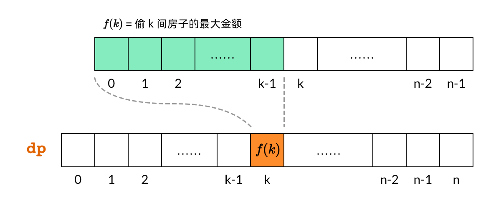

### 背包问题
有一个可装重量为`W`的背包和`N`个物体，其中第`i`个物品的重量为`wt[i]`，价值为`val[i]`，现在用这个背包装物品，最多能装的价值是多少？

```java
    public int knapsack(int W, int N, int[] wt, int[] val) {
        assert N == wt.length;
        // base case 已初始化
        int[][] dp = new int[N + 1][W + 1];
        for (int i = 1; i <= N; i++) {
            for (int w = 1; w <= W; w++) {
                if (w - wt[i - 1] < 0) {
                    // 这种情况下只能选择不装入背包
                    dp[i][w] = dp[i - 1][w];
                } else {
                    // 装入或者不装入背包，择优
                    dp[i][w] = Math.max(
                        dp[i - 1][w - wt[i-1]] + val[i-1], 
                        dp[i - 1][w]
                    );
                }
            }
        }
        
        return dp[N][W];
    }
```

- 需要注意的点：
1. **物体个数**是第一个数组元素，
2. 外层循环也是物体个数
3. `dp[i][w]` 表示第i个物体，使用w容量的背包，可以装到的最大价值是

### 贪心算法
[435. 无重叠区间](https://leetcode.cn/problems/non-overlapping-intervals)<br>
**题目**：输入一个区间的集合，请你计算，要想使其中的区间都互不重叠，至少需要移除几个区间？<br>
比如说输入是 intervals = [[1,2],[2,3],[3,4],[1,3]]，算法返回 1，因为只要移除 [1,3] 后，剩下的区间就没有重叠了。<br>
**解析**：如果先计算出区间中有多少是不重合的区间，那减去剩下的即为结果

1. 按照结束时间排序
2. 边界为第一个区间的右边界，如果下一个区间的边界比它大，那么这两个区间一定不会重合
3. 更新右边界，如果遇到重合就更新答案
```java
    public int eraseOverlapIntervals(int[][] intervals) {
        Arrays.sort(intervals, new Comparator<int[]>() {
            @Override
            public int compare(int[] o1, int[] o2) {
                return o1[1] - o2[1];
            }
        });

        int res = 0;
        int end = intervals[0][1];
        for (int[] interval: intervals) {
            if (interval[0] >= end) {
                // 更新 end
                end = interval[1];
            } else {
                res++;
            }
        }
        
        return res -1;
    }
```

[55. 跳跃游戏](https://leetcode.cn/problems/jump-game/)<br>
**题目**：给定一个非负数组，初始位置是数组的第一个下标。数组中每个元素代表在该位置能跳跃的最大长度。判断是否能达到最后一个下标<br>
**解析**：就是往前跳
```java
    public boolean canJump(int[] nums) {
        if (nums == null) {
            return false;
        }
        //前n-1个元素能够跳到的最远距离
        int k = 0;
        for (int i = 0; i <= k; i++) {
            //第i个元素能够跳到的最远距离
            int temp = i + nums[i];
            //更新最远距离
            k = Math.max(k, temp);
            //如果最远距离已经大于或等于最后一个元素的下标,则说明能跳过去,退出. 减少循环
            if (k >= nums.length - 1) {
                return true;
            }
        }
        //最远距离k不再改变,且没有到末尾元素
        return false;
    }
```

[45. 跳跃游戏 II](https://leetcode.cn/problems/jump-game-ii/)<br>
**题目**：背景同上，求最少需要多少步跳到最后一个位置<br>
**解析**：目标是最后一个位置，最后一步是确定的，所以只需要看前面步数<br>

```java
    public int jump(int[] nums) {
        // 记录当前能跳跃到的位置的边界下标
        int border = 0;
        // 记录在边界范围内，能跳跃的最远位置的下标
        int maxPosition = 0;
        // 记录所用步数
        int steps = 0;
        for(int i=0;i<nums.length-1;i++){ // 不需要检查最后一个位置是因为，最后一个位置我们不用跳了已经
            // 继续往下遍历，统计边界范围内，哪一格能跳得更远，每走一步就更新一次能跳跃的最远位置下标
            // 其实就是在统计下一步的最优情况
            maxPosition = Math.max(maxPosition,nums[i]+i);
            // 如果到达了边界，那么一定要跳了，下一跳的边界下标就是之前统计的最优情况maxPosition
            // 并且步数加1
            if(i==border){
                border = maxPosition;
                steps++;
            }
        }
        return steps;
    }
```
### 动态规划
**一维和二维dp区别**：
* 单个数组或者字符串需要用动归时， `dp[i]` 定义为 `nums[0:i]` 中每个状态的最好结果
* 当两个数组或者字符串时，`dp[i][j]` 定义为 `A[0:i]` 和 `B[0:j]` 之间匹配结果

**例题**： [198. 打家劫舍](https://leetcode.cn/problems/house-robber/)<br>
题目：每间房内都藏有一定的现金（给定数组），不能偷连续两家，返回偷到到最多金额



```java
    public int rob(int[] nums) {
        int n = nums.length;
        int[] dp = new int[n + 1];
        // 相当于初始化两个状态，不偷第一个屋子dp[0]和偷第一个屋子dp[1]
        dp[0] = 0; dp[1] = nums[0];
        for (int i = 2; i < dp.length; i++) {
            // 前一个屋子偷了，这个就不能偷了；要么前一个屋子没偷，偷这个屋子
            dp[i] = Math.max(dp[i - 2] + nums[i-1], dp[i-1]);
        }
        return dp[n];
    }
```

### 首先，区分两个概念：子序列可以是不连续的；子数组（子字符串）需要是连续的


**例题**：[300. 最长递增子序列](https://leetcode.cn/problems/longest-increasing-subsequence/)<br>
**题目**：输入一个无序的整数数组，请你找到其中最长的严格递增*子序列*的长度<br>
比如说输入 nums=[10,9,2,5,3,7,101,18]，其中最长的递增子序列是 [2,3,7,101]，所以算法的输出应该是 4

```java
    public int lengthOfLIS(int[] nums) {
        int[] dp = new int[nums.length];
        // base case：dp 数组全都初始化为 1
        Arrays.fill(dp, 1);

        for (int i = 0; i < nums.length; i++) {
            // 每次遍历，都把前面所有的对比一遍，然后更新dp[i]
            for (int j = 0; j < i; j++) {
                if (nums[i] > nums[j]) {
                    // 只用和[i] 对比，因为dp[i-1] 是除去i后的最长递增
                    // 以 nums[i] 为结尾的递增子序列
                    dp[i] = Math.max(dp[i], dp[j] + 1);
                }
            }
        }
        return Arrays.stream(dp).max().getAsInt();
    }
```


**例题**：[1143. 最长公共子序列](https://leetcode.cn/problems/longest-common-subsequence/)<br>
**题目**：给你输入两个字符串 s1 和 s2，请你找出他们俩的最长公共子序列，返回这个子序列的长度。<br>
**比如**：s1 = "zabcde", s2 = "acez"，它俩的最长公共子序列是 lcs = "ace"，长度为 3，所以算法返回 3<br>
[题解参考](https://leetcode.cn/problems/longest-common-subsequence/solution/fu-xue-ming-zhu-er-wei-dong-tai-gui-hua-r5ez6/)
### 状态定义
`dp[i][j]` 表示 text1[0:i-1] 和 text2[0:j-1] 的最长公共子序列。<br>
`dp[i][j]` 可以初始化为 0。当 i = 0 或者 j = 0 的时候，dp[i][j]表示的为空字符串和另外一个字符串的匹配
### 状态转移方程
* 当 `text1[i - 1] == text2[j - 1]` 时，说明两个子字符串的最后一位相等，所以最长公共子序列又增加了 1
* 当 `text1[i - 1] != text2[j - 1]` 时，说明两个子字符串的最后一位不相等，那么此时的状态 dp[i][j] 应该是 dp[i - 1][j] 和 dp[i][j - 1] 的最大值。
```java
    public int longestCommonSubsequence(String text1, String text2) {
        int M = text1.length(), N = text2.length();
        int[][]dp = new int[M + 1][ N + 1];
        for (int i = 1; i <= M; i++) {
            for (int j = 1; j <= N; j++) {
                // 现在 i 和 j 从 1 开始，所以要减一
                if (text1.charAt(i - 1) == text2.charAt(j - 1)) {
                    dp[i][j] = dp[i - 1][j - 1] + 1;
                } else {
                    dp[i][j] = Math.max(dp[i - 1][j], dp[i][j - 1]);
                }
            }
        }

        return dp[M][N];
    }
```
