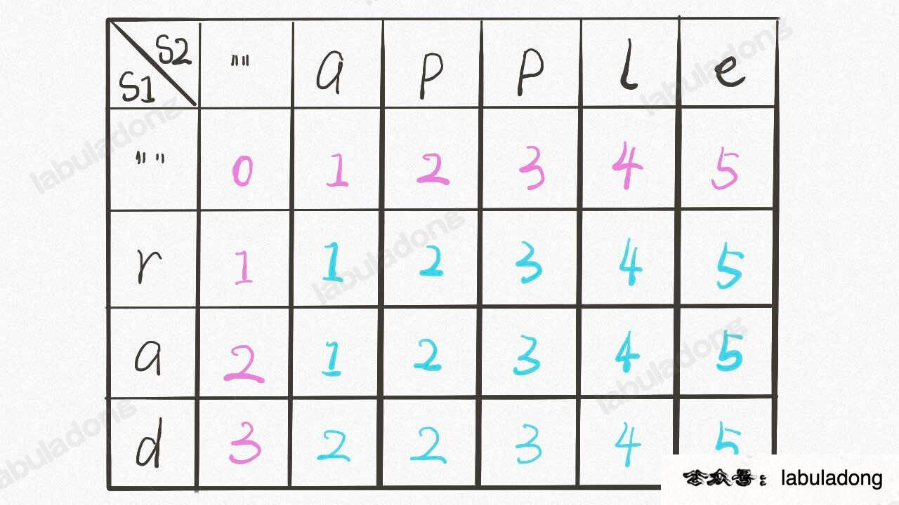

## 背包问题
### 1.0-1背包问题
有一个可装重量为`W`的背包和`N`个物体，其中第`i`个物品的重量为`wt[i]`，价值为`val[i]`，现在用这个背包装物品，最多能装的价值是多少？
- 由于数组索引从 0 开始，而我们定义中的 i 是从 1 开始计数的，所以 val[i-1] 和 wt[i-1] 表示第 i 个物品的价值和重量

```java
    public int knapsack(int W, int N, int[] wt, int[] val) {
        assert N == wt.length;
        // base case 已初始化
        int[][] dp = new int[N + 1][W + 1];
        for (int i = 1; i <= N; i++) {
            for (int w = 1; w <= W; w++) {
                if (w - wt[i - 1] < 0) {
                    // 这种情况下只能选择不装入背包
                    dp[i][w] = dp[i - 1][w];
                } else {
                    // 装入或者不装入背包，择优
                    dp[i][w] = Math.max(
                        dp[i - 1][w - wt[i-1]] + val[i-1], 
                        dp[i - 1][w]
                    );
                }
            }
        }
        
        return dp[N][W];
    }
```
### 2.完全背包问题
- _每个物品有无限量供应_

**例题5**：[322. 零钱兑换](https://leetcode.cn/problems/coin-change/description/)<br>
**题目**：给你 k 种面值的硬币，面值分别为 c1, c2 ... ck，每种的数量无限，再给一个总金额 amount，问你最少需要几枚凑出这个金额，如果不可能凑出，算法返回 -1 。<br>
**前提条件**：<br>
**思路**：<br>


```java
class Solution {
    public int coinChange(int[] coins, int amount) {
        int[] dp = new int[amount + 1]; // 凑到 i 金额需要的最小硬币数目，数组长度+1为了循环正常运行

        Arrays.fill(dp, amount+1); // 填充一个不可能的极大值
        dp[0] = 0;
        for (int coin: coins) {
            for (int i = 0; i <= amount; i++) {
                if (coin <= i) { // 当前数额>=当前硬币数额，就可以进行计算
                    // 和amount+1（极大值）对比，有可能coin==3，amount为2，所以需要dp[i]来保证这种异常情况
                    // 每个coin都会循环计算dp[i]
                    // dp[i - coin]可能等于amount + 1
                    dp[i] = Math.min(dp[i], dp[i - coin] + 1); 
                }
            }
        }

        return (dp[amount] == amount + 1) ? -1: dp[amount]; // 凑不出就是-1，凑得出返回本身
    }
}
```


**例题5**：[518. 零钱兑换 II](https://leetcode.cn/problems/coin-change-ii/description/)<br>
**题目**：给定不同面额的硬币 coins 和一个总金额 amount，写一个函数来计算可以凑成总金额的硬币组合数。<br>
**前提条件**：<br>
**思路**：<br>
按照第i种硬币可以选 0个,1个，2个，3个，，，，k个划分集合 `f[i][j]`。其中`k*coin[i] <= j`，也就是说在背包能装下的情况下，枚举第i种硬币可以选择几个。

- 第i种硬币选 0个，`f[i][j] = f[i-1][j]`
- 第i种硬币选 1个，`f[i][j] = f[i-1][j - coin]`
...
- 第i种硬币选 k个，`f[i][j] = f[i-1][j - k*coin]`

**第 `i` 种硬币为 `coins[i−1]`，第 1 种硬币为` coins[0]`，第 0 种硬币为空**


```java
class Solution {
    public int change(int[] coins, int amount) {
        int n = coins.length;
        int[][] dp = new int[n + 1][amount + 1]; // 使用 i 个硬币，凑到 j 金额的组合个数
        
        dp[0][0] = 1; //用0种硬币凑到0金额的方法，初始状态
        for (int i = 1; i <= n; i++) {
            int coin = coins[i - 1]; // coin序号从0开始算的
            for (int j = 1; j <= amount; j++) {
                for (int k = 0; k * coin <= j; k++) {
                    dp[i][j] += dp[i - 1][j - k*coin];
                }
            }
        }
        return dp[n][amount];
    }
}
```
- 需要注意的点：
1. **物体个数**是第一个数组元素，
2. 外层循环也是物体个数
3. `dp[i][w]` 表示第i个物体，使用w容量的背包，可以装到的最大价值是

## 贪心算法
[435. 无重叠区间](https://leetcode.cn/problems/non-overlapping-intervals)<br>
**题目**：输入一个区间的集合，请你计算，要想使其中的区间都互不重叠，至少需要移除几个区间？<br>
比如说输入是 intervals = [[1,2],[2,3],[3,4],[1,3]]，算法返回 1，因为只要移除 [1,3] 后，剩下的区间就没有重叠了。<br>
**解析**：如果先计算出区间中有多少是不重合的区间，那减去剩下的即为结果

1. 按照结束时间排序
2. 边界为第一个区间的右边界，如果下一个区间的边界比它大，那么这两个区间一定不会重合
3. 更新右边界，如果遇到重合就更新答案
```java
    public int eraseOverlapIntervals(int[][] intervals) {
        Arrays.sort(intervals, new Comparator<int[]>() {
            @Override
            public int compare(int[] o1, int[] o2) {
                return o1[1] - o2[1];
            }
        });

        int res = 0;
        int end = intervals[0][1];
        for (int[] interval: intervals) {
            if (interval[0] >= end) {
                // 更新 end
                end = interval[1];
            } else {
                res++;
            }
        }
        
        return res -1;
    }
```

[55. 跳跃游戏](https://leetcode.cn/problems/jump-game/)<br>
**题目**：给定一个非负数组，初始位置是数组的第一个下标。数组中每个元素代表在该位置能跳跃的最大长度。判断是否能达到最后一个下标<br>
**解析**：就是往前跳
```java
    public boolean canJump(int[] nums) {
        if (nums == null) {
            return false;
        }
        //前n-1个元素能够跳到的最远距离
        int k = 0;
        for (int i = 0; i <= k; i++) {
            //第i个元素能够跳到的最远距离
            int temp = i + nums[i];
            //更新最远距离
            k = Math.max(k, temp);
            //如果最远距离已经大于或等于最后一个元素的下标,则说明能跳过去,退出. 减少循环
            if (k >= nums.length - 1) {
                return true;
            }
        }
        //最远距离k不再改变,且没有到末尾元素
        return false;
    }
```

[45. 跳跃游戏 II](https://leetcode.cn/problems/jump-game-ii/)<br>
**题目**：背景同上，求最少需要多少步跳到最后一个位置<br>
**解析**：目标是最后一个位置，最后一步是确定的，所以只需要看前面步数<br>

```java
    public int jump(int[] nums) {
        // 记录当前能跳跃到的位置的边界下标
        int border = 0;
        // 记录在边界范围内，能跳跃的最远位置的下标
        int maxPosition = 0;
        // 记录所用步数
        int steps = 0;
        for(int i=0;i<nums.length-1;i++){ // 不需要检查最后一个位置是因为，最后一个位置我们不用跳了已经
            // 继续往下遍历，统计边界范围内，哪一格能跳得更远，每走一步就更新一次能跳跃的最远位置下标
            // 其实就是在统计下一步的最优情况
            maxPosition = Math.max(maxPosition,nums[i]+i);
            // 如果到达了边界，那么一定要跳了，下一跳的边界下标就是之前统计的最优情况maxPosition
            // 并且步数加1
            if(i==border){
                border = maxPosition;
                steps++;
            }
        }
        return steps;
    }
```
## 动态规划
**一维和二维dp区别**：
* 单个数组或者字符串需要用动归时， `dp[i]` 定义为 `nums[0:i]` 中每个状态的最好结果
* 当两个数组或者字符串时，`dp[i][j]` 定义为 `A[0:i]` 和 `B[0:j]` 之间匹配结果

### 1.打家劫舍系列
**例题**： [198. 打家劫舍](https://leetcode.cn/problems/house-robber/)<br>
**题目**：每间房内都藏有一定的现金（给定数组），不能偷连续两家，返回偷到到最多金额


```java
    public int rob(int[] nums) {
        int n = nums.length;
        int[] dp = new int[n + 1];
        // 相当于初始化两个状态，不偷第一个屋子dp[0]和偷第一个屋子dp[1]
        dp[0] = 0; dp[1] = nums[0];
        for (int i = 2; i < dp.length; i++) {
            // 前一个屋子偷了，这个就不能偷了；要么前一个屋子没偷，偷这个屋子
            dp[i] = Math.max(dp[i - 2] + nums[i-1], dp[i-1]);
        }
        return dp[n];
    }
```
### 2.股票买卖系列
**例题**：买卖股票的最佳时机<br>
**当不包含手续费等条件时，可以用*贪心*解决** `待完善`
```java
    public static int maxProfit_greedy(int[] prices){
        int minPrice = prices[0], profit =0;
        for(int i=1; i<prices.length; i++){
            minPrice = Math.min(minPrice, prices[i]);
            profit = Math.max(prices[i]-minPrice, profit);
        }
        return profit;
    }
```

**例题**： [714. 买卖股票的最佳时机含手续费](https://leetcode.cn/problems/best-time-to-buy-and-sell-stock-with-transaction-fee/)<br>
**题目**：给定一个整数数组 `prices`，其中 `prices[i]`表示第 i 天的股票价格 ；整数 fee 代表了交易股票的手续费用。<br>
**思路**：
1. `dp[i][0]`代表手里无股票 `dp[i][1]`代表买进，手里有股票
2. 最后结果应是手里股票卖出
3. 买卖过程只扣取一次fee，这个fee在买进的时候扣
```java
    public int maxProfit(int[] prices, int fee) {
        int n = prices.length;
        int [][] dp = new int[n][2];

        // base case
        dp[0][0] = 0; // 开始没买入
        dp[0][1] = -prices[0] - fee; // 开始去买了股票，也扣了fee

        for(int i=1;i<n;i++){
            dp[i][0] = Math.max(dp[i-1][0], dp[i-1][1] + prices[i]); 
            dp[i][1] = Math.max(dp[i-1][1], dp[i-1][0] - prices[i] - fee);
        }
        return dp[n-1][0];
    }
```


### 3.子序列问题 
**首先，区分两个概念：子序列可以是不连续的；子数组（子字符串）需要是连续的**


**例题**：[300. 最长递增子序列](https://leetcode.cn/problems/longest-increasing-subsequence/)<br>
**题目**：输入一个无序的整数数组，请你找到其中最长的严格递增*子序列*的长度<br>
比如说输入 nums=[10,9,2,5,3,7,101,18]，其中最长的递增子序列是 [2,3,7,101]，所以算法的输出应该是 4

```java
    public int lengthOfLIS(int[] nums) {
        int[] dp = new int[nums.length];
        // base case：dp 数组全都初始化为 1
        Arrays.fill(dp, 1);

        for (int i = 0; i < nums.length; i++) {
            // 每次遍历，都把前面所有的对比一遍，然后更新dp[i]
            for (int j = 0; j < i; j++) {
                if (nums[i] > nums[j]) {
                    // 只用和[i] 对比，因为dp[i-1] 是除去i后的最长递增
                    // 以 nums[i] 为结尾的递增子序列
                    dp[i] = Math.max(dp[i], dp[j] + 1);
                }
            }
        }
        return Arrays.stream(dp).max().getAsInt();
    }
```


**例题**：[1143. 最长公共子序列](https://leetcode.cn/problems/longest-common-subsequence/)<br>
**题目**：给你输入两个字符串 s1 和 s2，请你找出他们俩的最长公共子序列，返回这个子序列的长度。<br>
**比如**：s1 = "zabcde", s2 = "acez"，它俩的最长公共子序列是 lcs = "ace"，长度为 3，所以算法返回 3<br>
[题解参考](https://leetcode.cn/problems/longest-common-subsequence/solution/fu-xue-ming-zhu-er-wei-dong-tai-gui-hua-r5ez6/)
**状态定义**
`dp[i][j]` 表示 `text1[0:i-1]` 和 `text2[0:j-1]` 的最长公共子序列。<br>
`dp[i][j]` 可以初始化为 0。当 i = 0 或者 j = 0 的时候，`dp[i][j]`表示的为空字符串和另外一个字符串的匹配
**状态转移方程**
* 当 `text1[i - 1] == text2[j - 1]` 时，说明两个子字符串的最后一位相等，所以最长公共子序列又增加了 1
* 当 `text1[i - 1] != text2[j - 1]` 时，说明两个子字符串的最后一位不相等，那么此时的状态 dp[i][j] 应该是 dp[i - 1][j] 和 dp[i][j - 1] 的最大值。
```java
    public int longestCommonSubsequence(String text1, String text2) {
        int M = text1.length(), N = text2.length();
        int[][]dp = new int[M + 1][ N + 1];
        for (int i = 1; i <= M; i++) {
            for (int j = 1; j <= N; j++) {
                // 现在 i 和 j 从 1 开始，所以要减一
                if (text1.charAt(i - 1) == text2.charAt(j - 1)) {
                    dp[i][j] = dp[i - 1][j - 1] + 1;
                } else {
                    dp[i][j] = Math.max(dp[i - 1][j], dp[i][j - 1]);
                }
            }
        }

        return dp[M][N];
    }
```

### 4.距离编辑
**例题**：[72. 编辑距离](https://leetcode.cn/problems/edit-distance/solution/)
**题目**：给你两个单词 word1 和 word2， 请返回将 word1 转换成 word2 所使用的最少操作数。<br>
- 你可以对一个单词进行如下三种操作：
1. 插入一个字符
2. 删除一个字符
3. 替换一个字符


从后向前算

**【题解】 [常规递归计算](https://labuladong.gitee.io/algo/di-er-zhan-a01c6/zi-xu-lie--6bc09/jing-dian--e5f5e/)（超时）**
```java
int minDistance(String s1, String s2) {
    int m = s1.length(), n = s2.length();
    // i，j 初始化指向最后一个索引
    return dp(s1, m - 1, s2, n - 1);
}

// 定义：返回 s1[0..i] 和 s2[0..j] 的最小编辑距离
int dp(String s1, int i, String s2, int j) {
    // base case
    // 把剩下没走完的距离加上当前的一步
    if (i == -1) return j + 1;
    if (j == -1) return i + 1;

    // 如果匹配就不算步数，只把索引向前移动
    if (s1.charAt(i) == s2.charAt(j)) {
        return dp(s1, i - 1, s2, j - 1); // 啥都不做
    }
    return min(
        dp(s1, i, s2, j - 1) + 1,    // 插入， s2相对于s1而言，调换对比主体就是 删除操作
        dp(s1, i - 1, s2, j) + 1,    // 删除
        dp(s1, i - 1, s2, j - 1) + 1 // 替换
    );
}

int min(int a, int b, int c) {
return Math.min(a, Math.min(b, c));
}
```

**【题解】 [动归解法](https://leetcode.cn/problems/edit-distance/solution/edit-distance-by-ikaruga/)（标准解法）**
   - 注意是从最后一个字母开始向前比较（字符串匹配都需要从最后一步比较）
   - `dp[i][j]` 代表 word1 中前 i 个字符，变换到 word2 中前 j 个字符，最短需要操作的次数
   - 需要考虑 word1 或 word2 一个字母都没有，预留 `dp[0][j]` 和 `dp[i][0]`
   - 按顺序计算，当计算 dp[i][j] 时，dp[i - 1][j] ， dp[i][j - 1] ， dp[i - 1][j - 1] 均已经确定了，需要取前三个状态中最小的一个，然后+1

```java
    public int minDistance(String word1, String word2) {
        int m = word1.length(), n = word2.length();
        int[][] dp = new int[m + 1][n + 1];
        
        for (int i = 1; i <= m; i++) {
            dp[i][0] = i;
        }
        for (int j = 1; j <= n; j++) {
            dp[0][j] = j;
        }

        for (int i = 1; i <= m; i++) {
            for (int j = 1; j <= n; j++) {
                if (word1.charAt(i - 1) == word2.charAt(j - 1)) {
                    dp[i][j] = dp[i - 1][j - 1];
                } else {
                    dp[i][j] = min(
                        dp[i - 1][j] + 1, // 插入
                        dp[i][j - 1] + 1, // 删除
                        dp[i - 1][j - 1] + 1 // 替换
                    );
                }

            }
        }
        return dp[m][n];
    }
```
