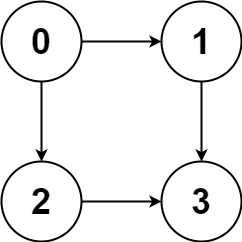

## 遍历一个邻接矩阵
如果图包含环，遍历框架就要一个 `visited` 数组进行辅助
```java
// 记录被遍历过的节点
boolean[] visited;
// 记录从起点到当前节点的路径，用来判断环！
boolean[] onPath;

/* 图遍历框架 */
void traverse(Graph graph, int s) {
    if (visited[s]) return;
    // 经过节点 s，标记为已遍历
    visited[s] = true;
    // 做选择：标记节点 s 在路径上
    onPath[s] = true;
    for (int neighbor : graph.neighbors(s)) {
    traverse(graph, neighbor);
    }
    // 撤销选择：节点 s 离开路径
    onPath[s] = false;
}
```

[797. 所有可能的路径](https://leetcode.cn/problems/all-paths-from-source-to-target/)

题目输入一幅有向无环图，这个图包含 n 个节点，标号为 0, 1, 2,..., n - 1，请你计算所有从节点 0 到节点 n - 1 的路径。
输入的这个 graph 其实就是「邻接表」表示的一幅图，graph[i] 存储这节点 i 的所有邻居节点。

比如输入 graph = [[1,2],[3],[3],[]]，就代表下面这幅图：



comments: 这题明确是没有环的，就可以不用到visited数组


## 并查集

```java
class UF {
    // 连通分量个数
    private int count;
    // 存储每个节点的父节点
    private int[] parent;

    // n 为图中节点的个数
    public UF(int n) {
        this.count = n;
        parent = new int[n];
        for (int i = 0; i < n; i++) {
            parent[i] = i;
        }
    }
    
    // 将节点 p 和节点 q 连通
    public void union(int p, int q) {
        int rootP = find(p);
        int rootQ = find(q);
        
        if (rootP == rootQ)
            return;
        
        parent[rootQ] = rootP;
        // 两个连通分量合并成一个连通分量
        count--;
    }

    // 判断节点 p 和节点 q 是否连通
    public boolean connected(int p, int q) {
        int rootP = find(p);
        int rootQ = find(q);
        return rootP == rootQ;
    }
   
    // 返回某个节点 x 的根节点
    public int find(int x) {
        if (parent[x] != x) {
            // 递归寻找根节点，并赋值
            parent[x] = find(parent[x]);
        }
        return parent[x];
    }

    // 返回图中的连通分量个数
    public int count() {
        return count;
    }
}
```

例题 [547. 省份数量](https://leetcode.cn/problems/number-of-provinces/)


```java

public class Solution {
    // 连通分量个数
    private int count;
    // 存储每个节点的父节点
    private int[] parent;

    public int findCircleNum(int[][] isConnected) {
        count = isConnected.length;
        // 存储每个节点的父节点
        int n = isConnected.length;
        parent = new int[count];
        for (int i = 0; i < n; i++) {
            parent[i] = i;
        }

        for (int i = 0; i < n; i++) {
            // 因为是无向图，只用算半边
            for (int j = i+1; j < n ; j++) {
                if (isConnected[i][j] == 1) {
                    union(i ,j);
                }
            }
        }
        return count;
    }

    // 返回某个节点 x 的根节点
    public int find(int x) {
        if (parent[x] != x) {
            // 递归寻找根节点，并赋值
            parent[x] = find(parent[x]);
        }
        return parent[x];
    }


    // 将节点 p 和节点 q 连通
    public void union(int p, int q) {
        int rootP = find(p);
        int rootQ = find(q);

        if (rootP == rootQ)
            return;

        parent[rootQ] = rootP;
        // 两个连通分量合并成一个连通分量
        count--;
    }
}    
```

## Dijkstra 算法

### 算法目的：找出从指定起点到指定目的最短距离
### 条件：要求节点边权重都大于0
### 寻找流程


- step1: 

| 数组S      | 数组V                  | dist[] 距离权重数组<br/>V1, V2, V3, V4, V5, V6 | path[] 上个连接点<br/>V1, V2, V3, V4, V5, V6 |
|----------|----------------------|------------------------------------------|-----------------------------------------|
| {V1}     | {V2, V3, V4, V5, V6} | {0, 10, 12, null, null, null}            |                                         |
| {V1, V2} |                      |                                          |                                         |
