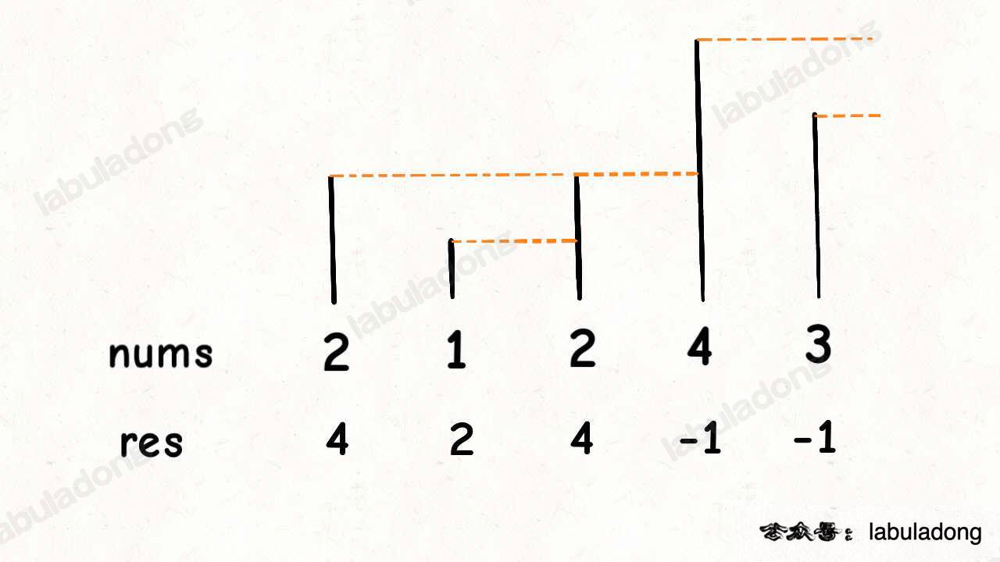

主要用栈解决，下一个最大值这种问题



[739. 每日温度](https://leetcode.cn/problems/daily-temperatures/)
题目：给一个数组表示每天的温度，返回一个数组，求下一个更高的温度出现在几天后。

```java
    public int[] dailyTemperatures(int[] temperatures) {
        int[] res = new int[temperatures.length];
        int n = temperatures.length;
        Stack<Integer> stack = new Stack<>();

        for (int i = n - 1; i >= 0; i--) {
            while (!stack.isEmpty() && temperatures[i] >= temperatures[stack.peek()]) {
                stack.pop();
            }

            if (!stack.isEmpty()) {
                res[i] = stack.peek() - i;
            }

            stack.push(i);
        }
        return res;
    }
```