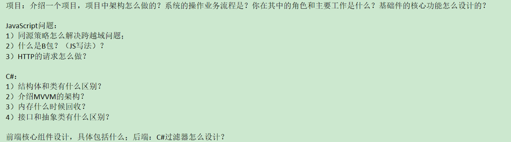

### [同源策略怎么解决跨域问题](https://blog.csdn.net/weixin_60678263/article/details/127830936)：
    保证同源：协议，域名，端口都相同 
    目的是：保护用户信息安全，为了防止跨脚本攻击，禁止浏览器通过脚步访问非同源数据 
    受到影响的资源: cookie, dom, ajax**请求响应结果会被拦截**
    解决方法：
1. CORS 后端设置
   - 当浏览器在进行跨域请求时，会在请求头中添加origin表明最近的协议，主机端口号
   - 当服务器接收到请求，并查看origin头部时，如果设置过允许访问，就添加到Access-Control-Allow-Origin到响应头中
   - 浏览器通过返回头部，判断是否可以进行跨域请求
2. JSONP
   - `<script>`标签允许不同源请求脚本
   - ?后方法提供接口参数，所以只支持GET，不支持POST
   ```javascript
    <script>
        function param(data){
            console.log(data);
        }
    </script>
    <script 
         
        src="http://localhost:8000/server/index.php?callback=param" /* 将param函数作为参数传递给服务器 */
        type="text/javascript">
    </script>
    ```
3. 反向代理
   - 配置一个和前端同源的服务器，然后去请求后端数据，然后返回
   - 同源策略限制的是浏览器与服务器之间，而服务器与服务器之间没有同源策略的限制
   - 如果前后端在一个服务器尚，不存在跨域问题
   - 在vue3中配置 vue.config.js
   ```javascript
    module.exports = {
    devServer:{
    //设置代理
    proxy: { //代理是从指定的target后面开始匹配的，不是任意位置；配置pathRewrite可以做替换
           '/api': { //axios访问 /api ==  target + /api
           target: 'http://localhost:3001', // 要访问的接口域名
           changeOrigin: true, //创建虚拟服务器
           pathRewrite: {
                '^/api': ''    //重写接口，去掉/api， 在代理过程中是否替换掉/api/路径
                }
           }
         }
       }
    }
   ```

### [JS中的闭包函](https://blog.csdn.net/m0_58646138/article/details/124846951):
```javascript
function a() {
    var i = 0;
    function b() {
        alert(++i)
    }
    return b;
}
var c = a(); // 实际上c指向了函数b
c(); // 变量c 引用了 函数b，形成了一个b包。（因为b被a引用，b又同时被c引用）

c = null; // 手动释放闭包对象

```
结果就是: **a() 执行后，闭包使得js的垃圾回收机制不会回收a占用内存，因为b依赖a中的变量i**
- 使用场景
  * 返回值：给对象设置私有变量，并用内部b方法返回值去访问
  * 缓存
- 缺点
  * 增大内存校友，引用的私有便携不会主动被销毁，需要手动赋null
  * 闭包设计跨域访问，会造成性能损失：可以通过把跨作用域变量 存在局部变量中，然后直接访问局部变量


### [mvvm和mvc框架](https://segmentfault.com/a/1190000015895017)
- View, Model, View-Model
  - View 通过View-Model的DOM Listeners 将事件绑定到Model上
  - Model 通过Data Bindings来管理View中的数据
  - ViewModel为中间桥接

* vue如何实现mvvm：
  - 响应式 Object.defineProperty，监听data属性变化
  - 模板：vue是通过render函数，把template解析为虚拟DOM
  - 渲染：将虚拟dom渲染为html
  - 最后通过v-model 指定在表达`<input>`、`<texarea>`以及`<select>`元素上创建**双向数据绑定**

**vm做的事情就是把dom操作封装起来，开发人员不用管Model 和 view之间时如何互相影响的，只要model发生改变了，view上肯定会呈现出现，当用户修改了view，model上也会跟着修改。这样开发人员可以不管dom，只需要注意如何操作model**
- MVC模型，Controller 是 view 和 model层间的操作


### vue核心组件
独立ui模块，比较常用的elementUI，route，axios
- 组件的核心概念：
  - 属性
  - 事件
  - 插槽
### http过程
1. 客户端解析url，建立tcp连接
2. 客户端发送http request（包括请求行，请求头，请求体）
3. 服务器接收并解析请求消息，执行业务操作，生成响应消息
4. 服务器发送HTTP respond（包括响应行，响应头和响应体）
5. 客户端接收并解析 respond，浏览器对内容进行渲染
6. 客户端和服务器关闭TCP连接


### 结构体和类区别
结构体是一种值类型，使用栈存储；类是引用类型，使用堆存储。
- 栈的空间小，但是访问效率高
- 堆的空间大，但是访问效率低
- 结构体变量使用完后自动回收，类实例需要垃圾回收机制来处理内存
### 接口和抽象类区别

| 比较   | 抽象类          | 接口                           |
|------|--------------|------------------------------|
| 关键字  | abstract     | interface                    |
| 创建   | 不能通过new来创建   | 不能通过new来创建                   |
| 继承   | 一个类只能继承一个抽象类 | 一个类可以继承多个接口                  |
| 变量   | 变量没有限制       | 变量必须是常量（public static final） |
| 构造方法 | 包含构造方法       | 不包含构造方法                      |
| 方法   | 没有限制         | 方法必须是public abstract的实例方法    |


### 内存什么时候回收 JVM
**GC是JVM自动完成的**
1. 首先在新生代中，在Eden区域分别内存，在经过minorGC后，如果对象存活，则进去s0 -> s1
2. 当Eden满了也会触发MinorGC（目标是新生代）
3. 在老年代中，满了会触发FullGC，对整个堆内存进行GC（期间所有线程停止工作等待GC完成）
4. MajorGC发生在老年代：new一个大型对象，Eden区放不下，触发MinorGC，然后会尝试在老年代中创建对象，如果创建不了，会触发MajorGC（目标是老年代），仍然创建不了会发生OOM

- 可以手动触发system.gc()方法，不建议，而且具体执行要看JVM
- JVM调优：官方建议是3:5- 新生代：老年代，总体思路就是增大老年代空间，避免清理老年代，触发fullgc