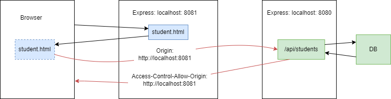
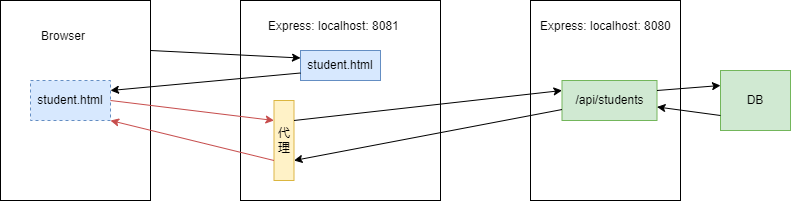

### [同源策略怎么解决跨域问题](https://blog.csdn.net/m0_63070387/article/details/128692886)：
    保证同源：协议，域名，端口都相同 
    目的是：保护用户信息安全，为了防止跨脚本攻击，禁止**浏览器**通过脚步访问非同源数据 
    会带来跨域问题: 阻止一个域的javascript和另一个域的内容进行互通--- cookie, dom, ajax**请求响应结果会被拦截**
    解决方法：
1. CORS 后端设置
   
   - 当浏览器在进行跨域请求时，会在请求头中添加`origin`表明发送者的源（前端地址）
   - 当服务器接收到请求，并查看origin头部时，如果设置过允许访问，就**添加到Access-Control-Allow-Origin到响应头中**
   - 浏览器通过返回头部，判断是否可以进行跨域请求
   - 在Springboot中使用cors
     - 在controller上添加@CrossOrigin注解
     - 配置CorsFilter：配置类，类中明确支持域信息等配置
     - 实现 WebMvcConfigurer 接口，重写adsCorsMappings方法，设置允许跨域
2. JSONP
   - `<script>`标签允许不同源请求脚本
   - ?后方法提供接口参数，所以只支持GET，不支持POST
   ```javascript
    <script>
        function param(data){
            console.log(data);
        }
    </script>
    <script 
         
        src="http://localhost:8000/server/index.php?callback=param" /* 将param函数作为参数传递给服务器 */
        type="text/javascript">
    </script>
    ```
3. 代理
4. 
   - 配置一个和前端同源的代理服务器，然后通过代理服务器去请求后端数据，然后返回
   - 相当于浏览器只跟前端服务器和前端代理服务器打交道
   - 在vue3中配置 vue.config.js
   ```javascript
    module.exports = {
    devServer:{
    //设置代理
    proxy: { //代理是从指定的target后面开始匹配的，不是任意位置；配置pathRewrite可以做替换
           '/api': { //axios访问 /api ==  target + /api
           target: 'http://localhost:8080', // 要访问的接口域名
           changeOrigin: true, //创建虚拟服务器
           pathRewrite: {
                '^/api': ''    //重写接口，去掉/api， 在代理过程中是否替换掉/api/路径
                }
           }
         }
       }
    }
   ```

### [JS中的闭包函](https://blog.csdn.net/m0_58646138/article/details/124846951):
```javascript
function a() {
    var i = 0;
    function b() {
        alert(++i)
    }
    return b;
}
var c = a(); // 实际上c指向了函数b
c(); // 变量c 引用了 函数b，形成了一个b包。（因为b被a引用，b又同时被c引用）

c = null; // 手动释放闭包对象

```
结果就是: **a() 执行后，闭包使得js的垃圾回收机制不会回收a占用内存，因为b依赖a中的变量i**
- vue中使用场景（函数无法访问其他函数的变量，需要闭包来达成）
  * 小范围代替全局变量
  * 返回值：给对象设置**私有变量**，并用内部b方法返回值去访问（访问私有变量的特权方法）
  * 原生JS中的setTimeout（作用是能够延迟一段时间后执行指定的函数）
    * 传递的第一个函数不能带参数，通过闭包可以实现传参效果
  * 连续触发事件n次，但在一定时间内只执行1次：=>实现**节流**和**防抖**
    ```javascript
    export function throttle(func, wait) {
    // 传2个参数，一个是回调函数，一个是间隔时间
          let timerId;
          return function (...args) {
             if (!timerId) {
                 timerId = setTimeout(() => {
                     timerId = null;
                     func.apply(this, args);
                 }, wait);
             }
          }
    }
    ```
  * 创建特权方法用于访问控制
- 缺点
  * 增大内存消耗，引用的私有便携不会主动被销毁，需要手动赋null
  * 闭包设计跨域访问，会造成性能损失：可以通过把跨作用域变量 存在局部变量中，然后直接访问局部变量


### [mvvm和mvc框架](https://segmentfault.com/a/1190000015895017)
- View, Model, View-Model
  - View 通过View-Model的DOM Listeners 将事件绑定到Model上
  - Model 通过Data Bindings来管理View中的数据
  - ViewModel为中间桥接

* vue如何实现mvvm：
  - 响应式 Object.defineProperty，监听data属性变化
  - 模板：vue是通过render函数，把template解析为虚拟DOM
  - 渲染：将虚拟dom渲染为html
  - 最后通过v-model 指定在表达`<input>`、`<texarea>`以及`<select>`元素上创建**双向数据绑定**

**vm做的事情就是把dom操作封装起来，开发人员不用管Model 和 view之间时如何互相影响的，只要model发生改变了，view上肯定会呈现出现，当用户修改了view，model上也会跟着修改。这样开发人员可以不管dom，只需要注意如何操作model**
- MVC模型，Controller 是 view 和 model层间的操作

### http过程
1. 客户端解析url，建立tcp连接
2. 客户端发送http request（包括请求行，请求头，请求体）
3. 服务器接收并解析请求消息，执行业务操作，生成响应消息
4. 服务器发送HTTP respond（包括响应行，响应头和响应体）
5. 客户端接收并解析 respond，浏览器对内容进行渲染
6. 客户端和服务器关闭TCP连接


### *结构体和类区别
结构体是一种值类型，使用栈存储；类是引用类型，使用堆存储。
- 栈的空间小，但是访问效率高（栈由操作系统自动分配释放，使用的是一级缓存）
- 堆的空间大，但是访问效率低（堆空间是用程序员分配释放，使用的是二级缓存）
- 结构体变量使用完后自动回收，类实例需要垃圾回收机制来处理内存
### 接口和抽象类区别

| 比较  | 抽象类                           | 接口                           |
|-----|-------------------------------|------------------------------|
| 关键字 | abstract - extends            | interface - implement        |
| 创建  | 不能通过new来创建                    | 不能通过new来创建                   |
| 继承  | 一个类只能继承一个抽象类                  | 一个类可以继承多个接口                  |
| 变量  | 变量没有限制                        | 变量必须是常量（public static final） |
| 构造方法 | 包含构造方法                        | 不包含构造方法                      |
| 方法  | 普通方法可以实现，但是抽象方法不能实现，且方法修饰符无限制 | 不允许有普通方法实现，且方法为public修饰      |
| 静态代码块使用 | 可以使用静态代码块                     | 不允许使用静态代码块                   |


### 内存什么时候回收 JVM
**GC是JVM自动完成的**
1. 首先在新生代中，在Eden区域分别内存，在经过minorGC后，如果对象存活，则进去s0 -> s1
2. 当Eden满了也会触发MinorGC（目标是新生代）
3. 在老年代中，满了会触发FullGC，对整个堆内存进行GC（期间所有线程停止工作等待GC完成）
4. MajorGC发生在老年代：new一个大型对象，Eden区放不下，触发MinorGC，然后会尝试在老年代中创建对象，如果创建不了，会触发MajorGC（目标是老年代），仍然创建不了会发生OOM

- 可以手动触发system.gc()方法，不建议，而且具体执行要看JVM
- JVM调优：官方建议是3:5- 新生代：老年代，总体思路就是增大老年代空间，避免清理老年代，触发fullgc

## vue
### [js的常见问题](https://blog.csdn.net/Jueyue15/article/details/120155179)
* js是一个单线程执行语言，其中任务分为同步任务和异步任务
* dom是文件对象模型，浏览器会结构会html文件，解析为一系列的节点
### vue2到vue3更新
- 选项式 -> 组合式
  - 选项式：代码分不同属性data、computed、methods等
  - 组合式：均在setup()中，根据业务逻辑分
  - 生命周期函数有调整
- 数据双向绑定原理不同
  - Object.defineProperty() 对数据进行劫持，结合发布者订阅者方式实现
    - 只能监听对象某个属性
    - 如果需要监听多属性多，需要用到for循环，消耗资源多
  - ES6等Proxy对数据代理
    - 支持监听整个对象和数组
### vue中常见组件
独立ui模块，比较常用的elementUI，route，axios
- 组件的核心概念：
    - 属性
    - 事件
    - 插槽
#### axios 与 promise
- promise 是es6 提供的异步解决方案
- axios是由promise封装的http库
- ajax异步请求数据时，不知道数据具体回来的事件，需要传入callback方法当ajax异步请求完成后执行
- promise对象接收resolve和reject两个参数，分别动作完成后的解析和捕获异常处理
  - new Promise().then()中获取成功数据
  - new Promise().catch()获取失败信息
#### [route](https://blog.csdn.net/Litt_White/article/details/126435871)
- 配置参数
  - `path` 用户配置访问路径
    - 带`/`表示绝对路径，不带`/`表示相对父路由下的路径
  - `name` 用户路由命名
  - `component` 表示需要映射的组件
  - `redirect` 表示重定向
  - `children` 用于路由嵌套
- 路由传参
  - 通过 `query` 传参和通过 `param` 传参
  - `keep-alive` 标签包裹`router-view`，对应所有路径的组件都会被缓存，避免组件频繁的被创建和销毁
#### element-ui
- vue的UI组件库

### 更新singleSelect自定义组件
- 更新公共组件singleSelect
  - :是v-bind的缩写，是动态绑定
  - 给`el-select`标签上，绑定`disable`属性，然后传入`isOptionDisable`
  - 调用`executeMethod('select-disable-by-condition')`的公共方法（mixin方法，在组件中引入，mixin中的方法和属性也就都并入到该组件中），为算子文件中配的key
  - 在js中创建函数名为value，实现业务返回bool，即给isOptionDisable传入值
- [el-form form表单校验](https://blog.csdn.net/m0_65132206/article/details/124853341)
  1. 添加属性:rule = ”myrules“
  2. myrules中定义校验规则，message 和 trigger: blur 在表单失焦时触发
  3. 在rules中自定义validator函数，校验通过直接返回callback()函数空，否在callback(new Error('核验不通过'))

