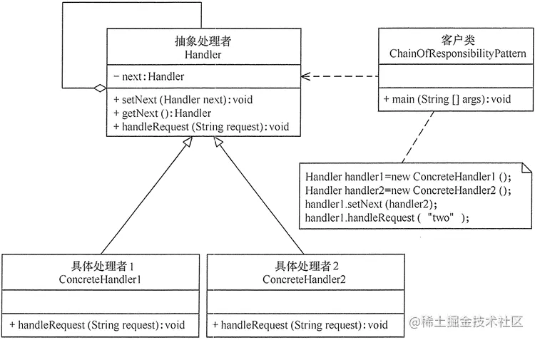
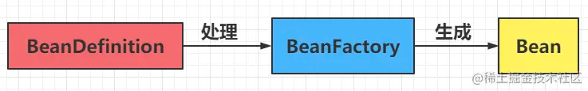

## [spring中的9种设计模式](https://zhuanlan.zhihu.com/p/114244039)
### [策略模式]()
一个功能在不同场景下逻辑不同，如国家返回当地法定假日，不同场景，不同实现类

### [Adapter 适配器模式](https://blog.51cto.com/u_15061944/4562911)：

springMVC通过HandlerAdapter把request转换方法接口实例对象，从而能反射执行method
```java
public class Bean {
    // 本身能力是画方形，需要画圆
    interface Adaptee {
        void drawTriangle();
    }

    interface Target{
        void drawCircle();
    }
    
    class Triangle implements Adaptee {
        @Override
        public void drawTriangle() {
            System.out.println("This is a Triangle!");
        }
    }

    abstract class Adapter implements Target {
        Adaptee adaptee;

        public Adapter(Adaptee adaptee) {
            this.adaptee = adaptee;
        }
    }

    class chinaMakeAdapter extends Adapter {
        public chinaMakeAdapter(Adaptee adaptee) {
            super(adaptee);
        }

        @Override
        public void drawCircle() {
            adaptee.drawTriangle();
            System.out.println("transfer triangle to circle!");
        }
    }

    public void main(String[] args) {
        Adaptee adaptee = new Triangle();
        Adapter adapter = new chinaMakeAdapter(adaptee);
        adapter.drawCircle();
    }
}
```

### [观察者模式](https://juejin.cn/post/6844904100459446285) :
- 观察模式流程:
1. 被观察者中添加观察者list
2. 当client调用**被观察者**，或某特定业务发生时，通知list中所有观察者
3. 观察者接接收到被调用的信息后，可以做出相应的业务操作


- spring中的事件驱动模型:
1. 事件：ApplicationEvent，就是被观察者 | 如果新建自定义事件需要继承它
2. 事件监听器：ApplicationListener，就是观察者，继承 EventListener，该接口中有onApplicationEvent函数 | 当监听事件发生时，会调用这个方法
3. 事件源：ApplicationListener，是spring的核心容器，负责发布**事件**
4. 事件管理：ApplicationEventMulticaster，用于Listener的注册和事件的广播

#### 使用场景:
- 在容器就绪后，初始化环境信息（租户信息
```java
public void ruleEngineListener implement ApplicationListener<ApplicationReadyEvent> {
    // 重写onApplicationEvent函数，实现初始化数据操作
    // 相当于监听，readyEvent，然后触发操作
}
```
- 消息队列

- 用户注册成功后发送通知邮件

### [责任链模式](https://www.cnblogs.com/xrq730/p/10633761.html)


### [工厂模式](https://juejin.cn/post/6992716383893061663)
   实例化对象不是用new，用工厂方法替代。将选择实现类，创建对象统一管理和控制。从而将调用者跟我们的实现类解耦。
#### 简单工厂   
* BeanFactory，创建各种不同类型，单例，原型的bean，通过getBean() 方法获取实例
* BeanFactory是IOC的根接口
* mybatis中，sqlsession的创建也使用到了工厂模式

#### 工厂方法
* FactoryBean通过getObject() 返回一个对象，自己是一个bean，也可以生成其他bean

#### 抽象工厂模式

### 构造者模式
用lombok
### 模版模式

### 单例模式

#### 双锁认证模式

- 为什么要加private：因为防止外界直接获取
- 为什么要有static：这个单例属于类，一个类只有一个单例
- 为什么要有volatile：[防止指令重排](https://blog.csdn.net/llllllkkkkkooooo/article/details/115360630)
  - `singleton = new Singleton();` 可分解为以下步骤：但是2，3步骤可能会交换（发送重排序），在多线程的环境下，
    线程A先执行了步骤3，这时线程B进入代码，来判断singleton是否为null，会直接获取到未初始化到singleton
     1. 分配对象内存空间
     2. 初始化对象
     3. 设置singleton指向1步骤中的内存空间

```java
public class Singleton {
    
    private volatile static Singleton instance = null;

    // 默认构造方法
    private Singleton(){}
    
    public static Singleton getInstance() {
        // 先检查实例是否存在，如果不存在才进入下面的同步代码块，减少多次synchronized，提升性能
        if (instance == null) {
            // 同步块，线程安全的场景实例
            synchronized (Singleton.class) {
                // 获取锁，防止多个实例创建
                if (instance == null) {
                    instance = new Singleton();
                }
            }
        }
        return instance;
    }
}
```
#### 使用场景：
   - Spring 依赖注入 Bean实例默认是单例的


### [装饰器模式](https://blog.csdn.net/qq_44750696/article/details/123542907)
动态的将新功能附加到对象上。在对象功能的拓展方面，比继承更有弹性。
   
   Spring中用到的包装器模式在类名上有两种表现：一种是类名中含有Wrapper，另一种是类名中含有Decorator。 
#### 使用场景：
   - 注册时发送注册成功邮件
   - MyBatis缓存机制，BaseExecutor中存放一级缓存，如果开启二级缓存时，会对一级缓存进行包装，比如加上LruCache（缓存清除）
   - Redis加缓存

   - java中的注解
```java
    public @interface AnnotaionName{
        public 属性类型 属性名() default 默认值;  // 不强制要求有default
    }
```
    
  * 使用：
  - 生成文档， @Documented， 将此注解包含在 javadoc 中 ，它代表着此注解会被javadoc工具提取成文档
  - pojo类中字段校验，用自定义注解实现
  - junit 框架，使用 @Test注解
  - 在反射中使用，（注解的生命周期，默认生命周期是class，需要runtime才会被反射获取到）
 
### 代理模式
   在不修改目标对象的功能前提下,对目标功能扩展，减少代码侵入
   * 静态代理
     涉及变动，需要同时修改目标对象和代理对象
   * 动态代理
     将目标对象传入代理类，实现动态代理。然后通过反射，给目标对象生成代理对象
   * 应用
   - **[AOP底层](https://blog.csdn.net/Cr1556648487/article/details/126777903)**，就是动态代理模式的实现：日志，事务，权限，检测
   - 使用代理动态切换数据源

### 装饰器模式 vs 代理模式
- 装饰器模式： 装饰者和被装饰者都实现同一个接口；强调增强自身功能
- 代理模式：为了实现对象的控制