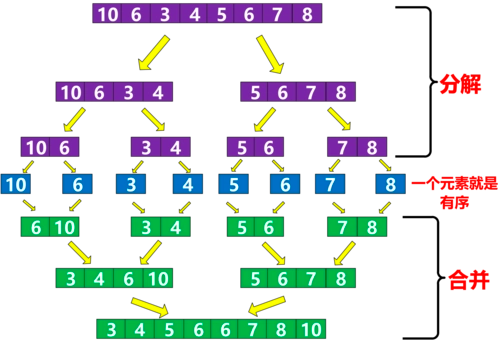

## 稳定排序

### 先分后治
### 稳定排序，O(nlogn)
### 需要一个临时数组，空间换时间
### 取中间元素为 pivot

### 图示

```java
public class MergeSort {
    private static void sort(int[] nums, int lo, int hi){
        // 将子数组的从 lo 到 hi 进行排序
        if(lo==hi) return;

        int mid = (lo + hi)/2;
        sort(nums, lo , mid);
        sort(nums, mid+1, hi);
        merge(nums, lo, mid, hi);
    }

    private static void merge(int[] nums, int l, int mid, int r) {
        /*
         * 将 nums[lo..mid] 和 nums[mid+1..hi] 这两个有序数组合并成一个有序数组
         *
         */
        // 临时数组
        int[] temp = new int[nums.length];
        // 复制 nums 到 temp
        for(int i = l; i<=r; i++){
            temp[i] = nums[i];
        }
        int i = l, j = mid+1;

        // 合并两个有序数组，每轮循环为nums[k] 赋值
        for (int k = l; k <= r; k++){
            if(i > mid){         // 左半边数组移交全部被合并（平替i == mid+1）
                nums[k] = temp[j];
                j++;
            } else if (j > r) {  // 右半边数组已被合并（平替j == r+1）
                nums[k] = temp[i];
                i++;
            } else if (temp[i] > temp[j]) {
                nums[k] = temp[j];
                j++;
            } else if (temp[i] <= temp[j]){
                nums[k] = temp[i];
                i++;
            }
        }
    }
}
```