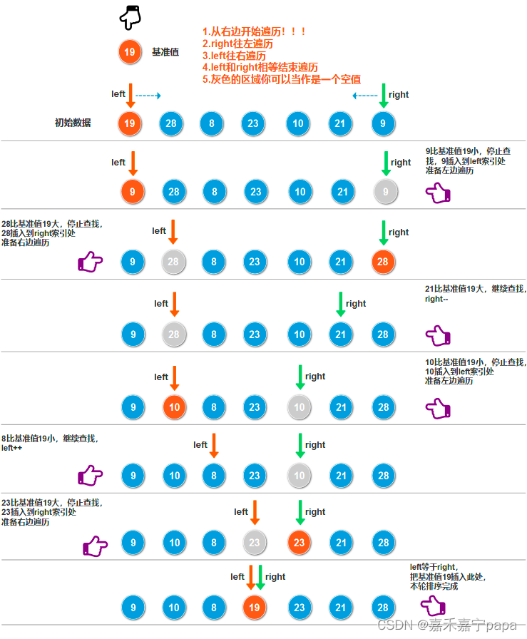

## 快速排序
* 原地排序
* 不稳定 O(n^2)，最好情况O(nlogn)
* 不稳定大原因是pivot位置选大不好，会对效率造成很大影响

### 排序过程
1. 取最左元素为pivot
2. 收尾两个指针往中间收缩，从右指针开始！
3. 右指针如果小于pivot，就将右指针赋给左指针，否则right--
4. 左指针如果大于pivot，就将左指针赋给右指针，否则left++
5. 一轮对比下，左右指针重合，pivot处于中间位置，左边比pivot小，右边比pivot大
6. 开始左右分别进行下一轮


```java
public class QuickSort {

    public void sort(int[] arr, int left, int right) {
        if (left < right) {
            // 每次找到一个基准，然后左右分别排序
            int pivot = partition(arr, left, right);
            // 基准元素一定比左边的数大，所以左边分区最大值是：pivot - 1，分区范围是[left, pivot - 1]
            sort(arr, left, pivot - 1);
            // 基准元素一定比右边的数小，所以右边分区最小值是：pivot + 1，分区范围是[pivot + 1, right]
            sort(arr, pivot + 1, right);
        }
    }

    public int partition(int[] arr, int left, int right) {
        // 定义基准元素
        int pivotValue = arr[left];
        // 遍历（条件就是分区左边索引小于右边索引）
        while (left < right) {
            // 从右边right开始遍历，找到一个数比基准数小
            while (left < right && arr[right] >= pivotValue) {
                // 未找到，继续往前找
                right--;
            }
            // 找到了，则把找到小值放到此时左边索引的位置
            // 第一次进入时,基准元素已存放到临时值pivotValue了，第一次就相当于放到基准位置了，同时，arr[right]也腾出了一个位置
            arr[left] = arr[right];
            // 从左边left开始遍历，找到一个数比基准数大
            while (left < right && arr[left] <= pivotValue) {
                // 未找到，继续往后找
                left++;
            }
            // 找到了，则把找到大值放到此时右边索引的位置（也就是腾出的位置）
            // 同时，arr[left]也腾出了一个位置
            arr[right] = arr[left];
        }
        // left等于right说明遍历结束了，把基准元素插入到腾出的位置，也就是arr[left]或者arr[right]
        arr[left] = pivotValue;
        // 返回基准元素插入的位置
        return left;
    }
}
```

**例题**：[75. 颜色分类](https://leetcode.cn/problems/sort-colors/)
**题目**：给定一个数组，其中只包含0，1，2，其中0、 1 和 2 分别表示红色、白色和蓝色<br>
**[解题ref](https://leetcode.cn/problems/sort-colors/solution/by-ac_oier-7lwk/)**
对它们进行排序，使得相同元素相邻
```java
    public void sortColors(int[] nums) {
        int l = 0, r = nums.length - 1, idx = 0;
        while (idx <= r) {
            if (nums[idx] == 0) {
                swap(nums, l, idx);
                l++;
                idx++;
            }
            else if (nums[idx] == 1) {
                idx++;
            }
            else {
                swap(nums, idx, r);
                r--;
            }
        }
    }

    void swap(int[] nums, int i, int j) {
        int c = nums[i];
        nums[i] = nums[j];
        nums[j] = c;
    }
```